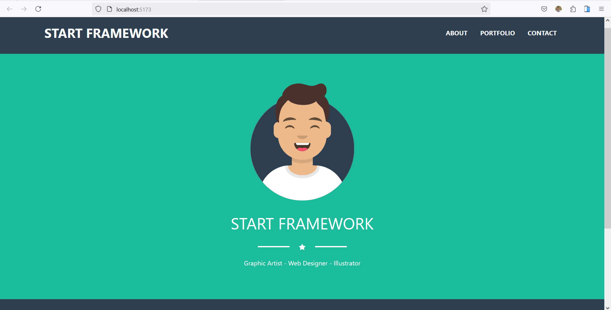

# React Project with Bootstrap and React Router DOM

This project is a simple web application built using **React**, **Bootstrap**, **Bootstrap Icons**, and **React Router DOM**. The goal of the project is to create an interactive user interface with routing between different pages.
<p align="center">
  <kbd>
    </img>
  </kbd>
</p>
<p align="center">
  <kbd>
    </img>
  </kbd>
</p>
<p align="center">
  <kbd>
    </img>
  </kbd>
</p>

## Features

- **React**: A JavaScript library for building user interfaces.
- **Bootstrap**: A CSS framework for quickly and efficiently styling pages.
- **Bootstrap Icons**: A library of icons integrated with Bootstrap.
- **React Router DOM**: For managing routing between pages in a React application.

## Available Pages

1. **Home Page**: Contains a simple introduction and an avatar image.
2. **About Page**: Provides information about the project or the developer.
3. **Portfolio Page**: Displays a collection of previous works or projects.
4. **Contact Page**: Includes a contact form.

## How to Run the Project

1. **Install Dependencies**: Install all required dependencies using the following command:

   ```bash
   npm install
## Project Structure

```plaintext
project-directory/
src/
├── Components/
│   ├── 1_header/
│   │   └── NavBar.js
│   ├── 2_home/
│   │   └── Home.js
│   ├── 3_about/
│   │   └── About.js
│   ├── 4_portfolio/
│   │   └── Portfolio.js
│   ├── 5_contact/
│   │   └── Contact.js
│   ├── 6_footer/
│   │   └── Footer.js
│   └── layout/
│       └── Layout.js
├── App.css
├── App.js
├── index.js
└── style.css

## Dependencies

1. **React: ^17.0.2**

2. **React Router DOM: ^6.0.0**

3. **Bootstrap: ^5.1.3**

4. **Bootstrap Icons: ^1.7.1**